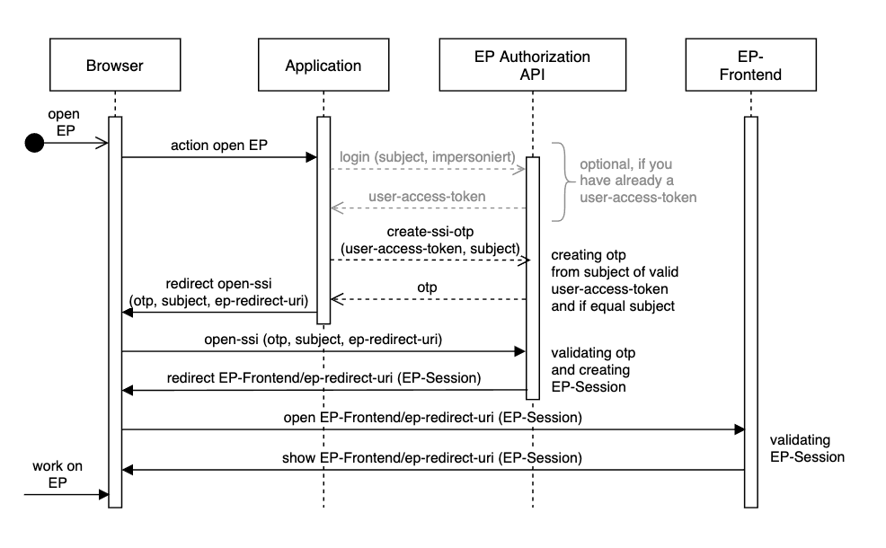

# Silent-Sign-In API

Die Silent-Sign-In API von Europace ermöglicht das Anmelden von Benutzern durch einen OAuth-Client und den Aufruf der Europace-Benutzeroberfläche im Browser.

---- 


[](https://docs.api.europace.de/baufinanzierung/authentifizierung/)


## Anwendungsfälle der API

- einen Benutzer anmelden und Europace nahtlos in einem iFrame oder neuen Browser-Tab anzeigen

## Dokumentation
[](https://europace.github.io/authorization-api/ssi.html)
[](https://github.com/europace/authorization-api/blob/master/docs/silent-sign-in/ssi-openapi.yaml)

Feedback und Fragen sind als [GitHub Issue](https://github.com/europace/authorization-api/issues/new) willkommen.          |


## Ablauf des Silent-Sign-In


## Beispiel: Benutzer anmelden und Vorgang öffnen

### Schritt 1 - Benutzer anmelden
Der Schritt ist optional, wenn bereits ein User-Access-Token vorliegt.

Um die API verwenden zu können, benötigt der OAuth2-Client folgende Scopes:
| Scope                                  | API-Usecase                                                      |
| -------------------------------------- | ---------------------------------------------------------------- |
| ` partner:login:silent-sign-in `       |   Silent-Sign-In erlaubt                                         |
| ` impersonieren `                      |   Andere Benutzer als subject anmelden       

> **Wichtig:** der Access-Token muss im Namen des Benutzers ausgestellt sein. 
Um diesen als Client zu erzeugen, kann das Impersonieren angewendet werden. Siehe: [Authorization-API-Impersonieren](https://docs.api.europace.de/common/authentifizierung/authorization-api/#wie-authentifiziere-ich-verschiedene-benutzer-mit-einem-client-impersionieren)

### Schritt 2 - One-Time-Password erzeugen
Aus Sicherheitgründen wird ein One-Time-Password für den Aufruf von Europace über den Browser verwendet.

Beispiel-Request:
``` http
POST /authorize/silent-sign-in?subject=[user-partner-id] HTTP/1.1
Host: www.europace2.de
Authorization: Bearer [user-access-token]
```

Beispiel-Resonse:
``` json
{
  "otp": "05448389A4014F49AFC896EB15B60A07AE8B"
}
```

### Schritt 3 - Europace öffnen
Mit dem OTP kann nun Europace geöffnet werden. Um den Vorgang AB45C2 direkt anzuzeigen, wird die redirect_uri mit `/vorgang/oeffne/[vorgangsnummer]` übergeben werden.

Beispiel-Request:
``` http
GET /authorize/silent-sign-in?subject=[user-partner-id]&redirect_uri=/vorgang/oeffne/AB45C2&otp=[otp] HTTP/1.1
Host: www.europace2.de
```

Beispiel-Resonse:
Redirect mit EP-Session auf `https://www.europace2.de/[redirect_uri]`

Liste der Redirect_uris:
* `/uebersicht` (default)
* `/vorgangsmanagement`
* `/vorgang/oeffne/[vorgangsnummer]`
* `/antragsuebersicht` (nur für Produktanbieter)
* `/partnermanagement` 
